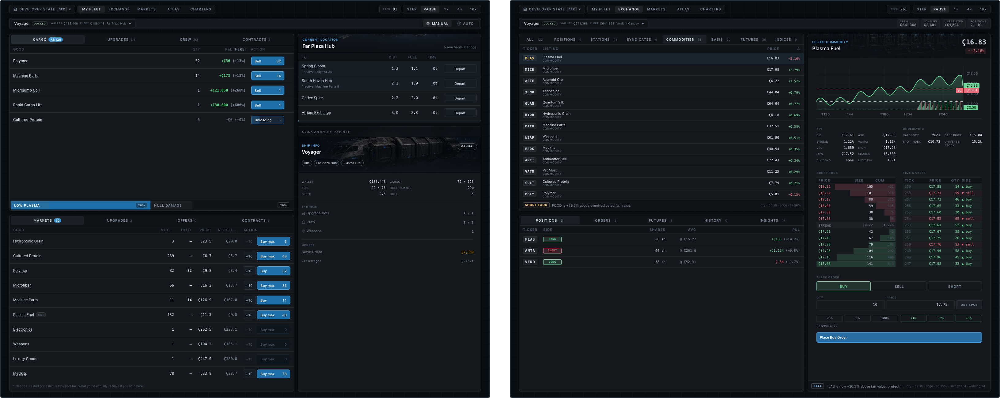

Ledgway is a browser game about running a space trucking outfit inside a living station economy. You start with one ship, one wallet, and a simple question: what should I buy here, and where can I sell it for more?

The loop grows from hands-on cargo runs into fleet coordination, staged crew automation, ship upgrades, and a simulated market desk where the same economy can be traded through station shares, syndicates, commodities, basis pairs, futures, and indices. It is part spreadsheet, part clicker, part idler, and part Wall Street terminal for a sector you can physically move goods through.

## Gameplay

- **Run the route yourself.** Buy cargo, refuel, take contracts, travel between stations, sell into shortages, and keep the ship repaired.
- **Unlock better guidance.** Ledger charters track manual actions and gradually open upgrade tiers, navigator offers, mechanic offers, pilot offers, and mercenary offers.
- **Hire a crew.** Navigators surface route and exchange suggestions, mechanics handle maintenance, pilots let auto mode run the ship, and mercenaries improve combat odds.
- **Invest in the economy.** Trade assets on the Exchange while your ships change the underlying station and commodity signals.
- **Build toward scale.** Buy more ships at shipyards, move into larger hulls, assign crews, and let established routes run while you focus on bigger opportunities.

## Current Build

The game currently includes:

- A deterministic single-player logistics economy with stations, goods, treasuries, NPC traders, contracts, fuel, maintenance, taxes, and docking fees.
- Manual ship control through **Cargo** with route-aware suggestions once a navigator is hired.
- Ship-local wallets, cargo, fuel, upgrades, crew, contracts, and auto-pilot mode.
- **Ledger** charters that gate upgrade tiers and crew offer pools through manual-action milestones.
- A full **Exchange** with spot-style listings, order books, player positions, limit orders, futures, history, dividends, borrow fees, settlement jobs, and navigator trade insights.
- **Markets** and **Atlas** tabs for commodity pressure, station context, ships, routes, syndicate control, lane danger, shipyards, and news.
- **Ledger** records for syndicate standing, combat encounters, fleet actions, and exchange trade history.
- Local save slots and a developer state for screenshot/documentation capture.

Current additions include buying new ships, controlling more than one ship, larger hull classes with traits, route danger, combat encounters, and weapon stats. Planned work is now about deeper dangerous jobs and higher-stakes fleet/market automation.

## Run Locally

```sh
npm install
npm run dev
```

Open the Vite URL for the playable game. The marketing page is available at `/website.html`, and the player wiki is available at `/wiki.html`.

Useful checks:

```sh
npm test
npm run build
npm run audit
npm run screenshots:wiki
```

## Project Layout

```text
src/sim/                    deterministic TypeScript simulation
src/ui/                     playable React app
src/site/                   website and wiki React surfaces
docs/                       design docs, roadmap, simulation notes, wiki source
public/site/screenshots/    public UI screenshots
scripts/                    screenshot and scenario tooling
```

Key docs:

- [Vision](docs/VISION.md)
- [Roadmap](docs/ROADMAP.md)
- [Simulation Model](docs/SIM.md)
- [Player Wiki](docs/WIKI.md)
- [Website Notes](docs/WEBSITE.md)
